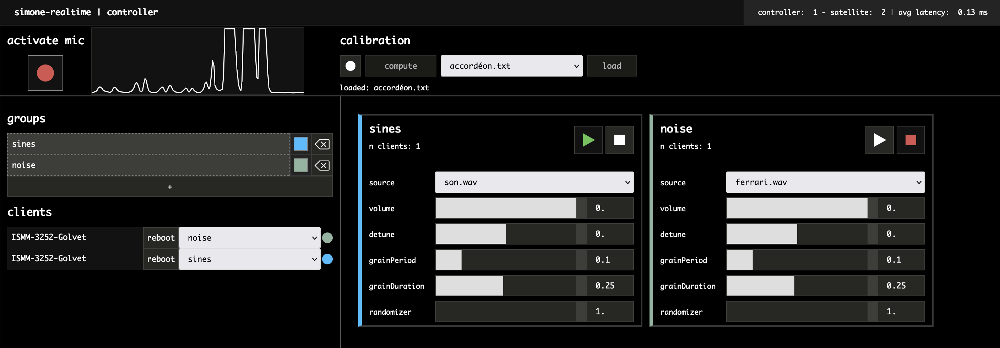

# `simone-v2`

_Simone_ is a web interface for musical improvisation with distributed systems of devices using synthesis by audio mosaicing and audio inputs.

This is the second version of _Simone_. The first version can be found [here](https://github.com/ircam-ismm/simone).

_Simone_ is developped using the [*soundworks*](https://github.com/collective-soundworks/soundworks/) framework.

## Installation

Install `Node.js` (LTS version)

Clone the repo or download it to the location you want on your computer then in the terminal: 

```
cd /path/to/simone
npm install
npm run build
```

## Starting the server

You will first need to create a config file for your application.
To do that, execute the following command `npx soundworks` and choose the `create a new environment config file`.

Once this is done, execute

```
npm run start
```

This should start the server and prints several IP adresses like this: 

```
+ https server listening on
    https://127.0.0.1:8000
    https://XXX.XXX.XXX.XXX:8000
```

## Putting sound in the soundbank

You will need to put soundfiles in the `simone/public/soundbank/` folder to be used by the application. Do not put them in any subfolders.

_Simone_ only support `wav` and `mp3` formats.

## How it works

The Web client provides you with a interface that controls a sound synthesis process based on audio inputs from your microphone.
The recorded sound is then transformed through a process of 'audio mosaicing' and played on the _Node_ clients connected to the server.

Audio mosaicing refers to the process of recomposing the temporal evolution of a given target audio file from segments cut out of source audio materials. (cf. http://recherche.ircam.fr/equipes/temps-reel/audio-mosaicking/).

To go into more details, your input (called the _target_ sound) is cut into small segments and for each of these segments we look for the 'most similar' segment in another sound (the _source_ sound).
The resulting sound then sound like the _target_ sound but reconstructed from patches from the _source_ sound.

In _Simone_ the _target_ sound is recorded by the microphone and the data from this _target_ sound is sent simultaneously to all connected _Node_ clients which can use a different _source_ sound.

Two modes of control are available in _Simone_ :  
1) A *real-time* mode in which audio input from the microphone is processed in real-time.
2) An *offline* mode (not yet available) in which a pre-recorded sound is used to control synthesis.

## The interface



The interface in divided in 3 parts

### Top panel: audio input
The top panel differs depending on the selected mode 

#### in real-time mode
In real-time mode, the top panel allows you to open the input stream from your microphone, to monitor the input level from your microphone and to calibrate the input sound 

Calibration is an essential part as it will determine normalization value to use when analyzing the input sound. Poor calibration will probably lead to incoherent results in the mosaicing process. 
To calibrate your sound, press the record button in the calibration section. This will start recording. Press again to stop recording and press the `compute` button to compute the calibration values. These values will be saved in a file (rename it if it is useful) in the `public/calibration` folder. You can load previous calibration files using the dropdown menu and the `load` button.
It is recommended that you record a calibration sound that encompasses the whole breadth (in volume, pitch, timbre, etc...) of the sound you intend to use when playing later.

#### in offline mode

### Left panel: groups and clients
The left panel allows you to monitor connected clients, to create groups of clients and to assign clients to groups.

The first part allows you to manage groups of clients. Groups will be used to control synthesis parameters. Clients assigned to the same group will share the same set of parameters and will play the same sound.
Use the `+` button to create a group. You can rename groups, assign a color to them and delete them. Upon creation, a control box for this group will be created in the right pansel.

The second part monitors all clients connected to the server. You can assign a group to a client using a dropdown menu. A client will not play sound until assigned to a group.

### Right panel: synthesis controls
This is the main playing part of _Simone_. The right panel displays a box for each group you create. This box contains elements that control the synthesis for each client assigned to this group.
The elements are the following :

- A play/stop button to start/stop synthesis
- A dropdown menu to select the _source_ sound used by this group
- A slider to control volume
- A slider to control the pitch of the sound (from -1 octave to +1 octave)
- A slider to control the period between two grains 
- A slider to control the duration of each grain
- A slider to randomize the result of the search for the most similar grain. A value of _n_ means that the _source_ grain played will be randomly selected among the _n_ most similar grains to the _target_ grain. 

## License
BSD-3-Clause